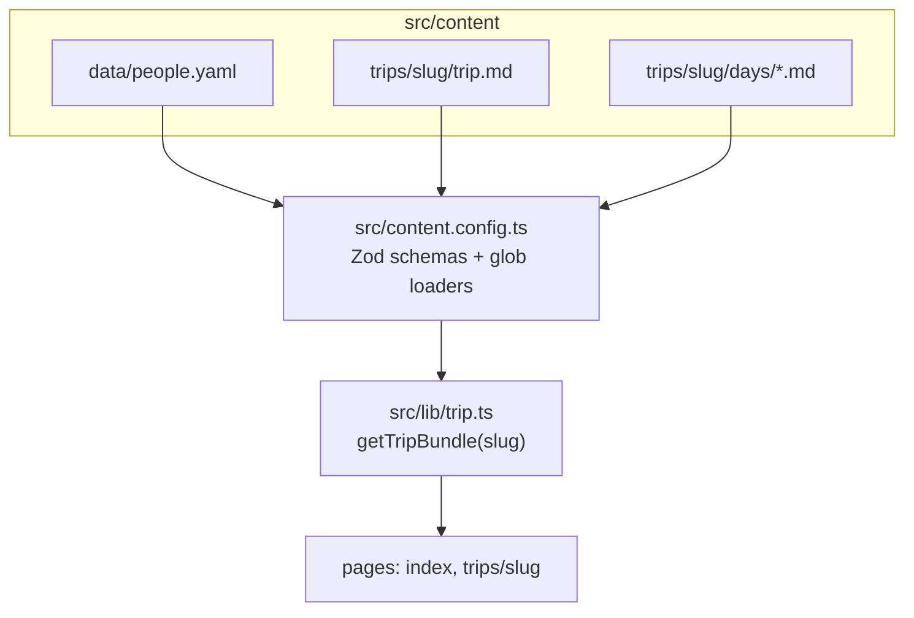
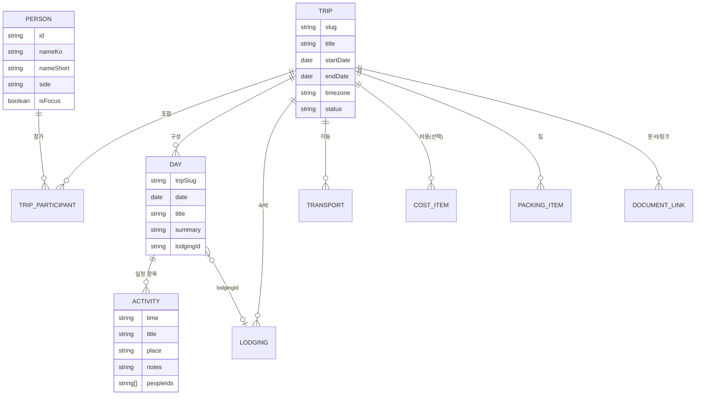
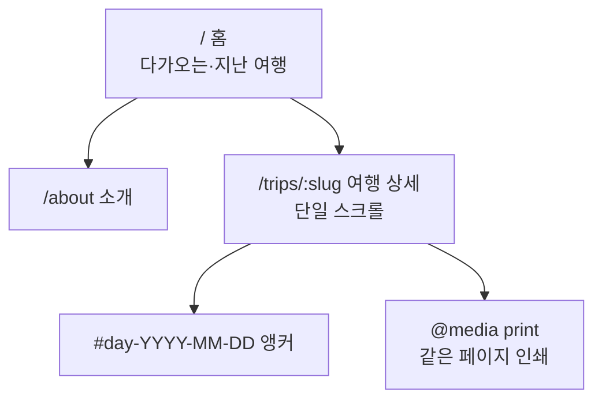
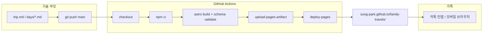

# family-travels 설계 문서

| 항목 | 내용 |
|------|------|
| **문서 제목** | 가족 여행 공유 사이트 (family-travels) 정보 구조·시각화·배포 설계 |
| **작성자** | sung-park (저장소 소유자; 기술 부모) |
| **날짜** | 2026-08-06 |
| **상태** | Draft (rev 3 — home clock + `_template` 제외 반영) |
| **저장소** | `/Users/sung-park/Dev/family-travels` → `https://github.com/sung-park/family-travels.git` (초기: README.md만 존재) |

---

## Overview

다세대 가족이 함께하는 여행을 **시온이(아이)를 중심으로** 기록·공유하기 위한 정적 웹사이트 설계이다. 양가 조부모, 엄마, 아빠, 아이가 일정을 같은 화면에서 보고, 숙소·교통·연락처 등 “지금 필요한 정보”에 빠르게 접근하는 것이 목표다.

백엔드·DB 없이 **Markdown/YAML 기반 파일 콘텐츠 + Astro SSG + GitHub Pages** 로 구성한다. 기술 담당(부모 1인)이 git/마크다운으로 작성·배포하고, 나머지 가족은 카톡으로 받은 링크만 열어 읽는다. 첫 시드 여행은 **2026-09-03 ~ 2026-09-09, 베트남 나트랑**이며, 과거 여행 백필은 범위 밖이다.

**MVP 고정 요약:** 공개 repo + sanitized 콘텐츠 · Project Pages(`base: /family-travels`) · 트립 단일 페이지 스크롤 · `getTripBundle(slug)` 로 trips/days/people 조인 · “오늘”은 **여행 timezone 달력일** · 클라 섬 2종만 — 상세 `TodayHighlight` + 홈 `RelativeTripMeta`(D-day/phase) · `_template` 은 컬렉션 제외.

---

## Background & Motivation

### 현재 상태
- 저장소는 `README.md` 제목만 있는 초기 커밋 상태다 (`sung-park/family-travels`).
- 여행 정보는 카톡·메모·예약 메일 등에 흩어져 있을 가능성이 높고, 다세대가 같은 “단일 진실 소스(SSOT)”를 공유하기 어렵다.

### 통증 포인트
| 문제 | 영향 |
|------|------|
| 일정·숙소·항공이 채팅에 묻힘 | 조부모·부모가 매번 “오늘 뭐 해?”를 반복 질문 |
| 예약번호·체크인 시간이 찾기 어려움 | 공항·호텔 현장에서 스트레스 |
| 모바일에 최적화되지 않은 공유 방식 | 폰·카톡 인앱 브라우저로 긴 글을 읽기 힘듦 |
| 여행이 쌓여도 지식으로 남지 않음 | 다음 여행 때 다시 처음부터 조사 |

### 동기
- **시온이 중심** 가족 여행 아카이브 + 공유 허브
- 9월 나트랑 전까지 **MVP로 실제로 쓸 수 있는 일정 페이지**
- 유지보수 부담 최소화: 한 명의 기술 부모가 콘텐츠 파일만 수정하면 배포

---

## Goals & Non-Goals

### Goals
1. **Trip 중심 정보 구조**: 일정(일별), 숙소, 교통, 참가자, 비용(선택), 짐·문서·링크, 메모를 일관된 스키마로 표현
2. **모바일 퍼스트·한국어 UI**: 조부모 스마트폰(카톡 공유 포함)에서 당일 일정·오늘 밤 숙소가 즉시 보이게
3. **GitHub Pages 무료 정적 호스팅**: 빌드·배포 자동화, 백엔드 비용 0
4. **파일 기반 콘텐츠**: Markdown + YAML frontmatter, git으로 버전 관리
5. **나트랑 2026-09 시드 콘텐츠**로 MVP 검증
6. **민감 정보 분리 전략**: 공개 가능한 일정 vs 예약번호·여권 등 비공개 처리

### Non-Goals (MVP 제외)
- 로그인·권한·실시간 협업 편집 (댓글/위시리스트 투표 등)
- 과거 여행 대량 백필
- 본격 사진 앨범·클라우드 미디어 CDN
- 자동 비용 정산·결제 연동
- 다국어 i18n 프레임워크 (UI는 한국어 고정; 필요 시 나중에)
- 네이티브 앱, PWA 고급 오프라인 동기화 (홈 화면 추가는 사용자 선택; 사이트는 **온라인 전제** — 외출 전 인쇄/스크린샷 권장)
- Day 서브 라우트, 실시간 위치 공유, 방문 분석 툴

---

## Key Decisions

| # | 결정 | 근거 |
|---|------|------|
| K1 | **콘텐츠 = 파일(Markdown/YAML), 앱 = Astro 5 SSG** | 가족 사이트 트래픽·복잡도 대비 백엔드 불필요. 콘텐츠 컬렉션·부분 하이드레이션·정적 HTML → GitHub Pages |
| K2 | **Trip이 1급 엔티티**, Day / Lodging / Transport는 Trip 번들에 속함 | “한 번의 여행”이 공유·인쇄·탐색의 단위 |
| K3 | **People은 전역 단일 파일 + Trip `participants[]`** | 시온이·양가 조부모 재사용; `role`은 trip 단위 |
| K4 | **공개 필드만 콘텐츠 스키마에 존재**; 민감정보는 gitignored `*.private.local.yaml` | 빌드 파이프가 실수로 private를 import하지 않음 |
| K5 | **한국어 UI + 날짜 표시**; **“오늘” = `trip.timezone` 기준 달력일** | 현지 일정·숙소 체크인이 1차 진실; 항공만 구간별 오프셋 표기. D-day/n일차는 동일 TZ 규칙 |
| K6 | **시온이 강조는 UX 레이어** (`isFocus` / role `child`) | 데이터는 일반 Person; 헤더·칩 스타일만 강조 |
| K7 | **과거 백필 비우선**; 스키마는 확장 가능 | 나트랑부터 아카이브 |
| K8 | **배포: GitHub Actions → GitHub Pages**; **`base: /family-travels`** (project site) | 원격 `sung-park/family-travels` 기준. `site: https://sung-park.github.io` |
| K9 | **기본: public repo + sanitized 콘텐츠 + 옵션 C(민감정보 오프라인)** | GitHub Free 개인 계정은 **public repo만 Pages 가능**. Private repo Pages는 Pro/Team/Enterprise 필요. 일정·아이 호칭이 git에 남는 **잔여 위험은 수용** |
| K10 | **MVP = 홈 목록 + 트립 단일 상세**(히어로·TodayHighlight·참가자·숙소·교통·일별·짐·링크) | 사진·정산·지도·인쇄 고도화는 Phase 2+ |
| **K11** | **콘텐츠 로딩 고정 형태** — 아래 §1.0 | 구현 thrash 방지. `trips` + `days` 컬렉션 + `people` 데이터 + `getTripBundle(slug)` |
| **K12** | **Day IA: 단일 페이지 + 앵커** (`#day-YYYY-MM-DD`). 서브 라우트 없음(MVP) | 조부모 스크롤·공유 URL 단순화 |
| **K13** | **상대 시각 UI만 소형 client 섬 (최대 2종)** — (1) 상세 `TodayHighlight` (2) 홈 카드 `RelativeTripMeta` (D-day·phase 라벨·섹션 배치). 일정 타임라인·숙소·본문은 **제로 JS 정적 HTML** | 순수 SSG는 빌드 시점 시계에 고정되어 D-day/“여행 중”이 수 주 동안 낡음. 라이브 상대 표현이 가족 UX의 핵심이므로 섬을 허용하되 **허용 목록 밖 하이드레이션 금지**. JS 실패 시 카드는 **절대 날짜**(`2026년 9월 3일 출발`)만으로도 읽힘 |
| **K14** | **표시 phase는 날짜 파생** (`pre` / `during` / `post`); `status`는 편집 생애주기만 | `planned`/`done` 등은 아카이브 라벨·`idea` 숨김. “여행 중” 뱃지·홈 배치는 클라 `getTravelPhase`로 자동 |

---

## Proposed Design

### 1. 정보 구조 / 데이터 모델

#### 1.0 콘텐츠 로딩 아키텍처 (K11 — MVP 고정)

Astro 5 기준 설정 파일: **`src/content.config.ts`** (레거시 `src/content/config.ts` 아님).

| 컬렉션/데이터 | 경로 패턴 | 로더 | id / 조인 키 |
|---------------|-----------|------|----------------|
| `trips` | `src/content/trips/*/trip.md` | `glob` + **제외 필터** | 폴더명 = `slug` (frontmatter `slug`와 일치 검증) |
| `days` | `src/content/trips/*/days/*.md` | `glob` + **제외 필터** | frontmatter **`tripSlug`** + **`date`** (필수) |
| `people` | `src/content/data/people.yaml` | 빌드 시 `import` 또는 `file` 로더 1회 | `person.id` |

**`_template` / 밑줄 접두 폴더 제외 (필수 — K11 부속):**

| 규칙 | 내용 |
|------|------|
| 제외 대상 | 경로 세그먼트에 `_template` 가 있거나, `trips/` 직하위 폴더명이 **`_` 로 시작** (`_template`, `_draft`, …) |
| 적용 위치 | (1) `content.config.ts` glob 결과 필터 또는 `generateId`/loader 옵션 (2) **`getAllTripBundles()` / `getTripBundle` 방어 assert** — 제외 누락 시 빌드 실패 또는 목록에서 강제 drop + `console.error` |
| 의도 | 온보딩 복사본이 홈·`getStaticPaths`에 실제 여행으로 노출되지 않게 함 |
| 템플릿 위치 | MVP: `src/content/trips/_template/` 유지(제외로 안전). 대안으로 `src/content/_scaffolds/trip/`(컬렉션 base 밖)도 허용하나 **이중 위치는 쓰지 않음** — `_template` + 제외가 기본 |

```ts
// src/lib/trip.ts — 제외 헬퍼 (PR3)
/** false → 컬렉션·홈·getStaticPaths에서 제외 */
export function isPublishableTripPath(entryPathOrSlug: string): boolean {
  const norm = entryPathOrSlug.replace(/\\/g, "/");
  // slug only: "_template"
  if (norm.startsWith("_")) return false;
  // full path: ".../trips/_template/trip.md"
  const afterTrips = norm.split("/trips/")[1];
  if (afterTrips) {
    const topFolder = afterTrips.split("/")[0];
    if (topFolder.startsWith("_")) return false;
  }
  return true;
}
```

**조인 헬퍼** (`src/lib/trip.ts`):

```ts
// 개념 계약 — 구현은 PR3
export type TravelPhase = "pre" | "during" | "post";

export interface TripBundle {
  trip: TripData;           // trips 컬렉션 entry.data + body
  slug: string;
  days: DayData[];          // date 오름차순
  people: Person[];         // participants에 등장하는 사람만 또는 전체 맵
  /** SSR/빌드 시각 기준 phase — 홈·상세 섬이 클라에서 재계산하는 값의 폴백 */
  phaseAtBuild: TravelPhase;
}

/** slug로 trip + days + people를 묶는다. day 누락/범위 밖이면 빌드 경고.
 *  `_template` 등 비게시 경로는 throw 또는 null. */
export async function getTripBundle(slug: string): Promise<TripBundle>;
/** 게시 가능한 trip만 반환. assert: 결과에 _template 없음 */
export async function getAllTripBundles(): Promise<TripBundle[]>;
```

**빌드 검증 (PR3/PR4):**
- `getAllTripBundles()` 결과에 `_template` / `_` 접두 slug **0건** (assert)
- 각 day의 `tripSlug`가 존재하는 **게시** trip과 일치 (`_template` day는 로더에서 이미 제외)
- `startDate`~`endDate` inclusive 매일 day 파일 존재 (없으면 `console.warn` 또는 빌드 스크립트 non-zero — MVP는 **warn + 빈 슬롯 UI**)
- day `date`가 범위 밖이면 에러
- `lodgingId` / `personId` 참조 무결성 warn

**경로 규칙:** 모든 콘텐츠는 **`src/content/...`** 만 사용한다. 문서·PR·샘플에서 `content/trips` 단독 경로는 쓰지 않는다.



#### 1.1 엔티티 관계 (논리 모델)

> 아래 ER은 **논리 관계**이다. 물리 파일은 trip frontmatter 배열(lodgings, transports, packing, links)과 day frontmatter `activities[]`로 평탄화되어 있다. `PACKING_ITEM` / `COST_ITEM` 등은 별도 컬렉션이 아니다.



#### 1.2 설계 원칙
- **파일 단위**: trip 메타 1파일 + day 파일 N개
- **영문 필드 키 + 한국어 값**
- **선택 필드 다수**: TBD로 선공개 가능
- **`peopleIds` 의미 (고정)**:
  | 값 | 의미 |
  |----|------|
  | 필드 **생략** | 전원 참가 (기본) |
  | **`[]` 빈 배열** | 전원 참가 (생략과 동일; 정규화 시 omit 권장) |
  | **`['sion','mom']` 등 비어 있지 않음** | 해당 인원만 |
- **빈 문자열 금지 권장**: `phone`, `url` 등은 없으면 **필드 생략**. 스키마에서 `z.string().url().optional()` 등으로 빈 문자열 거절 또는 `preprocess`로 `""` → `undefined`
- **공개 스키마에 PNR/예약번호 필드 없음** (`pnrPublic` 같은 플래그도 두지 않음)

#### 1.3 Person (전역)

경로: **`src/content/data/people.yaml`**

```yaml
# src/content/data/people.yaml
people:
  - id: sion
    nameKo: 시온
    nameShort: 시온이
    side: nuclear          # nuclear | maternal | paternal | other
    generation: child      # child | parent | grandparent
    isFocus: true
  - id: mom
    nameKo: 엄마
    nameShort: 엄마
    side: nuclear
    generation: parent
  - id: dad
    nameKo: 아빠
    nameShort: 아빠
    side: nuclear
    generation: parent
  - id: maternal-grandpa
    nameKo: 외할아버지
    nameShort: 외할아버님
    side: maternal
    generation: grandparent
  - id: maternal-grandma
    nameKo: 외할머니
    nameShort: 외할머님
    side: maternal
    generation: grandparent
  - id: paternal-grandpa
    nameKo: 친할아버지
    nameShort: 할아버님
    side: paternal
    generation: grandparent
  - id: paternal-grandma
    nameKo: 친할머니
    nameShort: 할머님
    side: paternal
    generation: grandparent
```

> UI는 `nameShort`를 카드·뱃지에 사용. 실제 호칭은 가족이 쓰는 말로 교체.

#### 1.4 Trip 메타 — **권장 형식: `trip.md` frontmatter** (대안 B 정렬, YAML 전용이 아님)

경로: **`src/content/trips/2026-nha-trang/trip.md`**

```markdown
---
slug: 2026-nha-trang
title: 시온이와 나트랑
titleShort: 나트랑
destination:
  countryKo: 베트남
  cityKo: 나트랑
  countryCode: VN
startDate: 2026-09-03
endDate: 2026-09-09
timezone: Asia/Ho_Chi_Minh
status: planned            # idea | planned | done | cancelled (편집용; active 없음 — phase는 파생)
focusPersonId: sion
updatedAt: 2026-08-06      # 선택; 없으면 빌드 시 해당 trip 트리 mtime 중 최댓값
summary: |
  시온이와 양가 가족이 함께하는 나트랑 여행.
  해변·여유로운 페이스·시온이 낮잠을 기준으로 일정을 잡습니다.
# coverImage: ./assets/cover.jpg   # Phase 2
tags:
  - 베트남
  - 바다
  - 가족

participants:
  - personId: sion
    role: child
  - personId: mom
    role: organizer
  - personId: dad
    role: organizer
  - personId: maternal-grandpa
    role: guest
  - personId: maternal-grandma
    role: guest
  # 친가 참가 확정 시에만 아래 주석 해제
  # - personId: paternal-grandpa
  #   role: guest
  # - personId: paternal-grandma
  #   role: guest

lodgings:
  - id: hotel-nha-trang-main
    name: (호텔명 TBD)
    nameKo: 나트랑 메인 호텔
    address: Nha Trang, Vietnam
    mapUrl: https://maps.google.com/?q=Nha+Trang
    # 현지 벽시계 시각 — offset 없이 date+time, TZ는 trip.timezone
    checkInDate: 2026-09-03
    checkInTime: "15:00"
    checkOutDate: 2026-09-09
    checkOutTime: "11:00"
    # phone: "+84-..."   # 공개 가능·확정 시만. 없으면 생략
    notesPublic: 조식 포함 여부 확인 중. 엘리베이터·그늘 동선 우선.

transports:
  - id: flight-icn-cxr-out
    type: flight
    label: 인천 → 나트랑
    operator: (항공사 TBD)
    from:
      name: 인천국제공항
      code: ICN
    to:
      name: 나트랑 공항
      code: CXR
    # 항공은 구간 오프셋 포함 ISO 권장
    departAt: 2026-09-03T00:00:00+09:00
    arriveAt: 2026-09-03T00:00:00+07:00
    notesPublic: 수하물·좌석 배정은 출발 전 가족 채널로 공유
  - id: flight-cxr-icn-return
    type: flight
    label: 나트랑 → 인천
    from:
      name: 나트랑 공항
      code: CXR
    to:
      name: 인천국제공항
      code: ICN
    departAt: 2026-09-09T00:00:00+07:00
    arriveAt: 2026-09-09T00:00:00+09:00

links:
  - label: 주베트남 대한민국 대사관 (하노이) · 긴급 연락 안내
    url: https://overseas.mofa.go.kr/vn-ko/index.do
    kind: emergency
  - label: 나트랑 참고 (TBD)
    url: https://en.wikipedia.org/wiki/Nha_Trang
    kind: reference

packing:
  - item: 여권
    for: all
    essential: true
  - item: 유아용 선크림
    for: [sion]
    essential: true
  - item: 수영복
    for: all
  - item: 모자·그늘용 용품
    for: all
    essential: true

costs:
  currency: KRW
  items: []

notesPublic:
  - 무더위·자외선 주의. 시온이 낮잠·조부모 페이스를 일정에 반영.
  - 일정은 현지 사정에 따라 유동적일 수 있음.
  - 응급: 베트남 경찰 113 · 응급의료 115 (일반 공개 번호). 호텔 프론트에 먼저 연락.
---

시온이와 함께하는 나트랑 여행 페이지입니다.
장문 소개·회고는 본문에 작성합니다.
```

**일시 저장 규칙 (타임존):**
| 종류 | 저장 방식 |
|------|-----------|
| Day `date`, lodging check-in/out | `YYYY-MM-DD` + optional `HH:mm`, **해석 TZ = `trip.timezone`** |
| Flight `departAt` / `arriveAt` | **오프셋 포함 ISO-8601** (공항 현지) |
| UI 2차 표기 | 항공 행에만 선택적으로 `한국 시각` 병기 (`Asia/Seoul`로 변환) |

#### 1.5 Day + Activity — **MVP 표준 = frontmatter `activities[]` (구 대안 B)**

경로: **`src/content/trips/2026-nha-trang/days/2026-09-03.md`**

본문 Markdown 헤딩 파싱은 **하지 않는다**. 본문은 보조 메모 전용.

```markdown
---
tripSlug: 2026-nha-trang
date: 2026-09-03
dayIndex: 1
title: 출국 · 나트랑 도착
summary: 인천 출발 후 나트랑 도착, 호텔 체크인, 가볍게 저녁.
lodgingId: hotel-nha-trang-main
mood: travel
activities:
  - time: "10:00"
    title: 집 출발
    place: 자택
    notes: 여권·유아 용품 최종 점검
  - time: "13:00"
    title: 인천공항 집결 (시각 TBD)
    place: ICN
    notes: 미팅 포인트는 출발 전 카톡 공지
  - time: "18:30"
    title: 나트랑 도착 · 이동
    place: CXR → 호텔
    notes: 픽업 또는 택시 (확정 후 수정)
  - time: "20:00"
    title: 호텔 체크인 · 저녁
    place: 나트랑 메인 호텔
    notes: 시온이 컨디션 보고 간단히
---

공항에 여유 있게 도착하고, 저녁은 호텔 근처에서 간단히.
조부모·아이 모두 첫날은 무리하지 않습니다.
```

**둘째 날 예시 (부분 참가):**

```yaml
tripSlug: 2026-nha-trang
date: 2026-09-04
dayIndex: 2
title: 해변 · 여유
summary: 시차 적응. 짧은 해변 산책과 낮잠.
lodgingId: hotel-nha-trang-main
mood: rest
activities:
  - time: "08:00"
    title: 호텔 조식
    place: 호텔
    # peopleIds 생략 = 전원
  - time: "10:00"
    title: 트란 푸 해변 산책
    place: Tran Phu Beach
    notes: 시온이 모자·물 필수. 그늘 구간 우선.
  - time: "14:00"
    title: 낮잠 · 휴식
    place: 호텔
    peopleIds: [sion, mom]
  - time: "17:00"
    title: 석양 보기
    place: 해변
```

#### 1.6 Private 데이터 (빌드 제외) — **단일 컨벤션**

**채택:** 트립 폴더 옆이 아니라, 저장소 루트 관례 파일명만 허용하고 gitignore한다.

| 항목 | 규칙 |
|------|------|
| 로컬 비밀 파일 | `**/*.private.local.yaml` (예: `src/content/trips/2026-nha-trang/notes.private.local.yaml`) |
| 예시(커밋됨) | `src/content/trips/_template/notes.private.local.yaml.example` (더미 값만) |
| 사이트 코드 | **import 금지**. README에 “1Password / 가족 노트 / 로컬 파일” 안내 |
| 사용하지 않음 | 별도 `content-private/` 트리 (혼동 제거; MVP에서 폐기) |

```yaml
# notes.private.local.yaml.example (커밋 가능 더미)
lodgings:
  hotel-nha-trang-main:
    confirmationCode: "EXAMPLE-NOT-REAL"
    guestNameOnBooking: "HONG GILDONG"
flights:
  flight-icn-cxr-out:
    pnr: "EXAMPLE"
documents:
  - label: 여행자보험 증권
    path: "/local/path/only"
```

PR1 `.gitignore`에 반드시 포함:

```
**/*.private.local.yaml
```

#### 1.7 나트랑 Day 시드 계획 (2026-09-03 ~ 09)

| 날짜 | dayIndex | 초안 테마 |
|------|----------|-----------|
| 09-03 | 1 | 출국 · 도착 · 체크인 |
| 09-04 | 2 | 해변 · 시차 적응 · 여유 |
| 09-05 | 3 | 주요 액티비티 (호핑/진품원 등 TBD) |
| 09-06 | 4 | 가족 공동 일정 + 휴식 밸런스 |
| 09-07 | 5 | 시온이 페이스 우선 자유 일정 |
| 09-08 | 6 | 기념 · 쇼핑 · 저녁 |
| 09-09 | 7 | 체크아웃 · 귀국 |

**시드 체크리스트 (PR4 / S2–S3):**
- [ ] `startDate`~`endDate` 매일 day 파일 + `tripSlug` 일치
- [ ] `links`에 `kind: emergency` **실공개 URL 1개 이상** (대사관 안내 등; 출발 전 필수)
- [ ] 친가 participant는 확정 전 주석 유지
- [ ] 민감 필드 없음
- [ ] 호텔 확정 후 `mapUrl`을 주소 쿼리로 갱신

확정 전에도 TBD로 **페이지 선공개** 후 채운다.

---

### 2. 웹사이트 시각화 / UX

#### 2.1 사이트맵 (MVP)



MVP에 **day 서브 라우트·별도 print URL 없음** (K12). Phase 2에서 `/print` 분리는 선택.

#### 2.2 페이지별 UX

**홈 (`/`)** — 상대 시계는 K13 `RelativeTripMeta` 섬

- 헤더: “우리 가족 여행” + 시온이 포커스 한 줄
- 카드 **1차 정보(정적 SSG, 항상 정확):** 제목, **절대 날짜** (`2026년 9월 3일 (목) ~ 9월 9일 (수)`), 도시, 참가 호칭, 링크
- 카드 **2차 정보(클라 섬, 라이브):** `RelativeTripMeta` — trip TZ 기준 D-day 또는 “여행 n일차” / phase 텍스트 뱃지 (`출발 전` · `여행 중` · `끝났어요`)
- **섹션 배치 (클라 phase 기준, 섬이 카드 data-attribute 또는 소량 DOM 이동/`hidden` 토글로 그룹):**

| 클라 phase | 홈 섹션 | 비고 |
|------------|---------|------|
| `pre` | **다가오는 여행** | `startDate` 오름차순. D-day 표시 |
| `during` | **지금 여행 중** (전용 섹션; 카드 0이면 섹션 숨김) | 다가오는/지난에 중복 넣지 않음. 뱃지 “여행 중” |
| `post` | **지난 여행** | `endDate` 내림차순. `status: done`은 라벨 보조일 뿐 필수 아님 |

- **SSR/JS 없음 폴백:** 모든 게시 카드를 **단일 목록** “여행”에 두고 절대 날짜만 표시(또는 빌드 시각 `phaseAtBuild`로 초기 섹션 배치). 상대 문구는 빈 자리 또는 숨김 — **절대 날짜가 primary**
- `status: idea` / `cancelled`: 홈 기본 숨김(상세 URL은 직접 접근 가능해도 됨)
- 빈 past: “아직 지난 여행이 없어요”
- 카드 → `/trips/<slug>/` (`base` 포함)

**홈과 SSG (정책 한 줄):** 순수 빌드 시각 D-day에 의존하지 **않는다**. 라이브 상대 표현은 **`RelativeTripMeta` 섬 전용**이며, 배포 주기와 무관하게 브라우저 시계 + `trip.timezone`으로 계산한다.

**여행 상세 (`/trips/2026-nha-trang/`)** — 섹션 고정 순서:

1. **히어로**: 제목, 날짜 범위, **텍스트 뱃지**  
   - phase 파생: `출발 전` / `여행 중` / `여행 끝`  
   - editorial `status`가 `cancelled`면 그 텍스트 우선
2. **TodayHighlight (P0, client island)** — §2.4
3. **참가자** 칩 (시온이 시각 강조)
4. **숙소** 카드
5. **교통**
6. **일별 일정**: 가로 날짜 칩 **+ 그 아래 항상 전체 일자 세로 목록**(칩만 믿지 않음)
7. **준비물 · 링크 · 공개 메모** (emergency 링크 상단 강조)
8. **푸터**: `updatedAt` 표시

**시각 위계**
| 우선순위 | 정보 | UI |
|----------|------|-----|
| P0 | 오늘(또는 출발일) 요약 | TodayHighlight; 여행 중일 때 sticky |
| P0 | 오늘 밤 숙소 | Highlight 내부 + 숙소 섹션 링크 |
| P1 | 교통 출발 시각 | 큰 시각 + 한국 시각 보조(항공) |
| P2 | 주간 일정 | 칩 + **전체 세로 day 리스트** |
| P3 | 짐·링크 | 접기 가능 |

**한국어·날짜 (`src/lib/dates.ts`)**
- 표시: `2026년 9월 3일 (목) ~ 9월 9일 (수)`
- 상대: `D-28`, `오늘`, `내일`, `여행 3일차` (1-based, `startDate` 기준, trip TZ)
- 활동 `time`: 현지 벽시계로 간주, `(현지)` 라벨 불필요 시 생략 가능
- 항공: `출발 09:00 (한국) → 도착 12:00 (현지)` 형태 권장

**인쇄**
- 동일 URL + 브라우저 인쇄; `@media print`로 네비·칩 sticky 숨김, 글자 확대
- **오프라인 백업**: 외출 전 당일 섹션 인쇄 또는 스크린샷 (호텔 Wi‑Fi 약함 대비). 사이트는 온라인 전제.

**접근성·조부모 UX (MVP 수용 기준)**
- 본문 **≥16px** (권장 17–18px), 터치 **≥44px**
- 상태·phase는 **텍스트 뱃지** (색만으로 구분 금지); 대비율 WCAG AA 목표
- `prefers-reduced-motion: reduce` 시 sticky/애니메이션 최소화
- 지도·전화: `tel:` / 맵 URL; `rel="noopener noreferrer"`
- **카카오톡 공유**
  - `BaseLayout`에 **Open Graph**: `og:title`, `og:description`, `og:url`, `og:locale`=`ko_KR`, 선택 `og:image` (트립 커버 또는 기본 패밀리 이미지)
  - `twitter:card` summary 동등 메타
  - 카톡 인앱 브라우저: 맵·전화가 막히면 페이지 하단에 짧은 도움말 — “右上 … 에서 **Safari/Chrome으로 열기**”
  - 배포 후 **카톡 링크 미리보기 스모크 테스트**를 PR2/PR6 수용 조건에 포함
- **1분 성공 기준 체크리스트**
  1. 카톡으로 URL 오픈 → 미리보기에 여행 제목 보임  
  2. 히어로 아래에서 오늘/출발 요약과 숙소 이름 확인  
  3. 스크롤 없이 칩 또는 바로 아래 day 목록으로 당일 활동 확인  

#### 2.3 와이어 (모바일)

```
┌─────────────────────────┐
│ 시온이와 나트랑  출발 전 │
│ 2026년 9월 3–9일 · 베트남│
├─────────────────────────┤
│ ★ 출발까지 28일         │  ← sticky when during
│ 9/3 요약 · 오늘 밤 숙소  │
│ [일정 위치로 이동]       │
├─────────────────────────┤
│ 참가: 시온이 엄마 …     │
├─────────────────────────┤
│ 🏨 숙소 / ✈️ 교통       │
├─────────────────────────┤
│ 📅 일정                 │
│ [3][4][5][6][7][8][9]   │
│ ▼ 9/3 출국 …            │  ← 항상 전체 목록
│ ▼ 9/4 해변 …            │
└─────────────────────────┘
```

#### 2.4 상대 시계 · phase · client 섬 예산 (K5, K13, K14)

```ts
// src/lib/dates.ts — 계약 (홈 섬·상세 섬 공유)
/** trip.timezone에서 현재 달력일 YYYY-MM-DD */
export function todayInTimeZone(timeZone: string, now?: Date): string;

/** start/end(YYYY-MM-DD)와 today 비교 */
export function getTravelPhase(
  startDate: string,
  endDate: string,
  timeZone: string,
  now?: Date
): "pre" | "during" | "post";

export function formatDday(startDate: string, timeZone: string, now?: Date): string;
export function dayNumber(startDate: string, date: string): number; // 1-based
```

##### 허용 client 섬 (K13 화이트리스트 — 이 외 `client:*` 금지)

| 섬 | 파일 | 사용 페이지 | 책임 | `client:` |
|----|------|-------------|------|-----------|
| **RelativeTripMeta** | `RelativeTripMeta.tsx` | 홈 `TripCard` 내부 | D-day / “여행 n일차”, phase 뱃지 텍스트, (선택) 카드를 올바른 섹션으로 보이게 하는 최소 DOM | `client:load` |
| **TodayHighlight** | `TodayHighlight.tsx` | 트립 상세 | 오늘/출발 요약, 오늘 밤 숙소, sticky when during | `client:load` |

공유: 두 섬 모두 `dates.ts` 순수 함수 import. 번들 최소화(날짜 유틸만).

**홈 폴백 (RelativeTripMeta 실패/비활성):** 절대 날짜 + 링크만 보이면 성공. D-day 자리 공란 OK.

**상세 폴백 (TodayHighlight 실패/비활성):** 히어로 절대 날짜 + 전체 day 스크롤 섹션으로 일정 확인 가능.

| phase | TodayHighlight 내용 |
|-------|---------------------|
| `pre` | “출발까지 N일” + **첫날** `summary` + 첫 숙소 + 첫 항공 한 줄 |
| `during` | “여행 n일차 · 오늘” + **해당 date day** summary + **오늘 밤 숙소** (`lodgingId` 해석) + “일정 보기” 앵커 |
| `post` | “여행이 끝났어요” + 마지막 날/회고 링크; 하이라이트는 비sticky |

**Sticky 규칙:** 상세에서 `phase === during` 일 때만 TodayHighlight를 `position: sticky; top: 0` (히어로 아래). `pre`/`post`는 문서 흐름만. `prefers-reduced-motion`이면 sticky 해제 가능.

**TodayHighlight props:** serializable trip 요약 + days[{date,title,summary,lodgingId}] + lodgings + timezone  
**RelativeTripMeta props:** `{ startDate, endDate, timezone, titleShort? }` 만 — 최소 payload

**날짜 칩 오버라이드 (MVP 최소):** 칩 클릭 시 해당 `#day-…`로 스크롤 (순수 앵커, 추가 JS 불필요). “가상 오늘” 오버라이드는 Phase 2.

**editorial `status` vs phase:**
| 필드 | 용도 |
|------|------|
| `getTravelPhase(...)` (클라 우선) | 히어로 문구, sticky, TodayHighlight, **홈 섹션·뱃지** |
| `phaseAtBuild` | SSR 초기 HTML 힌트·SEO 무관 폴백 |
| `status: idea \| planned \| done \| cancelled` | 홈에서 idea/cancelled 숨김, 완료 라벨, 취소선. **`active` 없음** |

귀국 후 워크플로: `status: done` 수동 설정 (S6). phase는 이미 `post`.

---

### 3. 기술 스택 (GitHub Pages)

#### 3.1 스택: **Astro 5 + Tailwind + Content Collections**

| 선택지 | 판정 |
|--------|------|
| **Astro** | **채택** |
| 11ty | 동등 대안이나 스키마·섬 UX는 Astro 유리 |
| Next + DB | 과함 |
| 순수 MD 테마 | 트립 UX 부족 |

부가: Tailwind, Pretendard 또는 시스템 폰트, 인라인 SVG 아이콘.  
**JS 예산 (K13):** `RelativeTripMeta` + `TodayHighlight` 두 섬만. 일정 본문·맵 임베드·네비는 정적(네비는 CSS-only). 추가 `client:*` 는 설계 변경 없이 금지.

#### 3.2 저장소 구조

```text
family-travels/
├── README.md
├── package.json
├── astro.config.mjs          # site + base: '/family-travels'
├── tsconfig.json
├── .gitignore                # **/*.private.local.yaml 포함 (PR1)
├── .github/workflows/deploy-pages.yml
├── public/
│   ├── favicon.svg
│   ├── og-default.png        # 카톡/OG 기본 이미지
│   └── robots.txt            # Disallow: / (검색 최소화; 완전 차단 아님)
├── src/
│   ├── content.config.ts     # Astro 5 collections + Zod
│   ├── content/
│   │   ├── data/
│   │   │   └── people.yaml
│   │   └── trips/
│   │       ├── _template/        # 컬렉션·getAllTripBundles 에서 제외 (K11)
│   │       │   ├── trip.md
│   │       │   ├── days/.gitkeep
│   │       │   └── notes.private.local.yaml.example
│   │       └── 2026-nha-trang/
│   │           ├── trip.md
│   │           ├── days/
│   │           │   ├── 2026-09-03.md
│   │           │   └── ...
│   │           └── assets/   # 공개 이미지만
│   ├── components/
│   │   ├── TripCard.astro
│   │   ├── RelativeTripMeta.tsx  # home client island (K13)
│   │   ├── DayTimeline.astro
│   │   ├── LodgingCard.astro
│   │   ├── ParticipantChips.astro
│   │   ├── TransportList.astro
│   │   ├── TodayHighlight.tsx    # detail client island (K13)
│   │   └── BaseHead.astro        # OG / 기본 메타
│   ├── layouts/BaseLayout.astro
│   ├── pages/
│   │   ├── index.astro
│   │   ├── about.astro
│   │   └── trips/[slug].astro
│   ├── lib/
│   │   ├── dates.ts
│   │   └── trip.ts               # getTripBundle
│   └── styles/global.css
```

#### 3.3 Content → Build → Deploy



#### 3.4 GitHub Actions

```yaml
# .github/workflows/deploy-pages.yml
name: Deploy to GitHub Pages
on:
  push:
    branches: [main]
  workflow_dispatch:
permissions:
  contents: read
  pages: write
  id-token: write
concurrency:
  group: pages
  cancel-in-progress: true
jobs:
  build:
    runs-on: ubuntu-latest
    steps:
      - uses: actions/checkout@v4
      - uses: actions/setup-node@v4
        with:
          node-version: 22
          cache: npm
      - run: npm ci
      - run: npm run build
        env:
          ASTRO_SITE: https://sung-park.github.io
      - uses: actions/upload-pages-artifact@v3
        with:
          path: dist
  deploy:
    needs: build
    runs-on: ubuntu-latest
    environment:
      name: github-pages
      url: ${{ steps.deployment.outputs.page_url }}
    steps:
      - id: deployment
        uses: actions/deploy-pages@v4
```

**수용 기준 (PR2):** 배포 URL HTTP 200, `base` 경로 자산 로드, 홈 타이틀 한국어.

Actions는 메이저 버전 태그(`@v4`)로 시작; 공급망 민감 시 이후 full commit SHA pin.

`astro.config.mjs`:

```js
export default defineConfig({
  site: "https://sung-park.github.io",
  base: "/family-travels",
  markdown: {
    // 안전: raw HTML 비활성 (Astro/ remark 기본 유지; allowDangerousHtml 켜지 않음)
  },
});
```

#### 3.5 역할 분리
| 역할 | 방법 |
|------|------|
| 기술 부모 | 로컬 또는 GitHub 웹 에디터로 MD 수정 → push |
| 가족 | Pages URL 북마크 / 카톡 공유 **읽기 전용** |

---

### 4. 콘텐츠 워크플로

#### 4.1 새 여행 추가
1. `src/content/trips/_template/` 복사 → `src/content/trips/<yyyy-slug>/`
2. `trip.md` 메타·participants·lodgings 초안
3. `days/` 에 기간 매일 파일 (`tripSlug`, `activities` TBD 가능)
4. `npm run dev` 확인
5. `main` 머지 → Actions 배포

#### 4.2 여행 중 수정
| 방법 | 상황 |
|------|------|
| GitHub 웹 에디터로 day MD | 호텔 와이파이 |
| 로컬 push | 每晚 정리 |
| 카톡 메모 → 저녁 반영 | 현장 즉시 수정 어려울 때 |

#### 4.3 나트랑 시드
| 단계 | 내용 | 시기 |
|------|------|------|
| S0 | 스키마·빈 페이지 | 스택 직후 |
| S1 | 참가자·날짜·D-day | 즉시 |
| S2 | 숙소·항공 TBD + **emergency 링크** | 예약 중 |
| S3 | 7일 day 골격 + 범위 검증 | 8월 |
| S4 | 액티비티·짐 구체화 | 출발 2주 전 |
| S5 | 여행 중 핫픽스 | 9/3–9 |
| S6 | `status: done` + 회고 본문 | 귀국 후 |

---

### 5. Privacy

#### 5.1 위협 모델
| 자산 | 심각도 | 처리 |
|------|--------|------|
| 여권·생년월일 | 높음 | 사이트·repo 공개 파일 **금지** |
| PNR·예약번호 | 중 | `*.private.local.yaml` / 1Password만 |
| 일정·숙소명·아이 호칭 | 낮~중 | **public repo 잔여 위험으로 명시 수용** (K9) |
| 아이 사진 | 중 | Phase 2에서 기본 미게시 |

#### 5.2 옵션
| 옵션 | 설명 |
|------|------|
| **A. public repo + sanitized** | **기본 채택** (Free 계정 Pages) |
| B. private repo + GitHub Pages | **Pro 이상 필요** — 현재 기본 아님 |
| C. 민감정보 완전 오프라인 | A와 항상 병행 |
| **D. private repo + Cloudflare Pages / Netlify (free)** | git 이력 비공개가 필수일 때 **탈출구** (계정 추가). 기본 경로는 아님 |

#### 5.3 실용 권장 (확정)
1. **`sung-park/family-travels` = public + A+C**
2. 사이트: 일정, 장소명, 대략 시각, 공개 맵, **기관** 긴급 링크
3. 예약번호·여권: 1Password/카톡 비공개 채팅/`*.private.local.yaml`
4. `robots.txt` Disallow — 보조일 뿐; **보안으로 간주하지 않음**
5. 카톡 URL은 가족 방에만; SNS 광역 게시 지양
6. **잔여 위험 문구 (README):** “이 저장소와 사이트에는 여행 일정과 가족 호칭이 공개됩니다. 예약번호·여권은 올리지 않습니다.”

---

### 6. API / Interface Changes — 전체 Zod 스키마

백엔드 API 없음. **`src/content.config.ts` 스키마 = 계약**.

```ts
import { defineCollection, z } from "astro:content";
import { glob, file } from "astro/loaders"; // Astro 5 loaders

const emptyToUndef = (v: unknown) => (v === "" ? undefined : v);

export const activitySchema = z.object({
  time: z.string().regex(/^\d{2}:\d{2}$/).optional(), // "09:30"
  title: z.string().min(1),
  place: z.string().min(1).optional(),
  notes: z.string().optional(),
  /** omit or [] = everyone; non-empty = subset */
  peopleIds: z.array(z.string().min(1)).optional(),
});

export const daySchema = z.object({
  tripSlug: z.string().min(1),
  date: z.string().regex(/^\d{4}-\d{2}-\d{2}$/),
  dayIndex: z.number().int().positive().optional(),
  title: z.string().min(1),
  summary: z.string().optional(),
  lodgingId: z.string().min(1).optional(),
  mood: z.enum(["travel", "rest", "active", "mixed"]).optional(),
  activities: z.array(activitySchema).default([]),
});

const destinationSchema = z.object({
  countryKo: z.string().min(1),
  cityKo: z.string().min(1),
  countryCode: z.string().length(2).optional(),
});

const participantSchema = z.object({
  personId: z.string().min(1),
  role: z.enum(["child", "organizer", "guest", "other"]).default("guest"),
});

const lodgingSchema = z.object({
  id: z.string().min(1),
  name: z.string().min(1),
  nameKo: z.string().optional(),
  address: z.string().optional(),
  mapUrl: z.string().url().optional(),
  checkInDate: z.string().regex(/^\d{4}-\d{2}-\d{2}$/),
  checkInTime: z.string().regex(/^\d{2}:\d{2}$/).optional(),
  checkOutDate: z.string().regex(/^\d{4}-\d{2}-\d{2}$/),
  checkOutTime: z.string().regex(/^\d{2}:\d{2}$/).optional(),
  phone: z.preprocess(emptyToUndef, z.string().min(1).optional()),
  notesPublic: z.string().optional(),
});

const placeCodeSchema = z.object({
  name: z.string().min(1),
  code: z.string().optional(),
});

const transportSchema = z.object({
  id: z.string().min(1),
  type: z.enum(["flight", "train", "bus", "car", "ferry", "walk", "other"]),
  label: z.string().min(1),
  operator: z.string().optional(),
  from: placeCodeSchema,
  to: placeCodeSchema,
  departAt: z.string().min(1), // ISO-8601 with offset for flights
  arriveAt: z.string().min(1).optional(),
  notesPublic: z.string().optional(),
});

const linkSchema = z.object({
  label: z.string().min(1),
  url: z.preprocess(emptyToUndef, z.string().url()),
  kind: z.enum(["reference", "booking", "map", "emergency", "other"]).default("reference"),
});

const packingSchema = z.object({
  item: z.string().min(1),
  for: z.union([z.literal("all"), z.array(z.string().min(1))]),
  essential: z.boolean().optional(),
});

const costItemSchema = z.object({
  id: z.string().min(1),
  label: z.string().min(1),
  amount: z.number().nonnegative(),
  paidBy: z.string().optional(),
  splitAmong: z.array(z.string()).optional(),
});

export const tripSchema = z.object({
  slug: z.string().min(1),
  title: z.string().min(1),
  titleShort: z.string().optional(),
  destination: destinationSchema,
  startDate: z.string().regex(/^\d{4}-\d{2}-\d{2}$/),
  endDate: z.string().regex(/^\d{4}-\d{2}-\d{2}$/),
  timezone: z.string().min(1), // IANA, e.g. Asia/Ho_Chi_Minh
  status: z.enum(["idea", "planned", "done", "cancelled"]).default("planned"),
  focusPersonId: z.string().optional(),
  updatedAt: z.string().regex(/^\d{4}-\d{2}-\d{2}$/).optional(),
  summary: z.string().optional(),
  coverImage: z.string().optional(),
  tags: z.array(z.string()).default([]),
  participants: z.array(participantSchema).min(1),
  lodgings: z.array(lodgingSchema).default([]),
  transports: z.array(transportSchema).default([]),
  links: z.array(linkSchema).default([]),
  packing: z.array(packingSchema).default([]),
  costs: z
    .object({
      currency: z.string().default("KRW"),
      items: z.array(costItemSchema).default([]),
    })
    .optional(),
  notesPublic: z.array(z.string()).default([]),
});

export const personSchema = z.object({
  id: z.string().min(1),
  nameKo: z.string().min(1),
  nameShort: z.string().min(1),
  side: z.enum(["nuclear", "maternal", "paternal", "other"]),
  generation: z.enum(["child", "parent", "grandparent", "other"]),
  isFocus: z.boolean().optional(),
});

export const peopleFileSchema = z.object({
  people: z.array(personSchema).min(1),
});

// defineCollection examples:
// trips: glob **/trip.md under trips, then filter isPublishableTripPath
// days:  glob **/days/*.md, exclude any path under _* trip folders
// assert getAllTripBundles().every(b => isPublishableTripPath(b.slug))
```

**페이지 계약**
- `getStaticPaths`: `getAllTripBundles()` → `slug` (**`_template` 미포함**)
- 홈: 정적 카드(절대 날짜) + 카드마다 `RelativeTripMeta` 섬; 섹션은 클라 phase로 **다가오는 / 지금 여행 중 / 지난** (§2.2). 빌드 시각 phase만으로 최종 분류하지 않음
- `updatedAt` 표시: frontmatter `updatedAt` 우선, 없으면 빌드 시 해당 트립 파일 mtime 최댓값(구현 노트: `fs.stat` in `getTripBundle` 또는 생략 시 숨김)

**검증 스크립트 (PR3):** `npm run check` → `astro check` + day 범위 warn + **`_template` 미게시 assert** + `todayInTimeZone` / `getTravelPhase` 픽스처.

---

### 7. Data Model Changes

| 버전 | 변경 |
|------|------|
| v1 MVP | people, trip, days.activities, lodgings, transports, links, packing, notesPublic |
| v2 | costs UI, coverImage/OG per trip, print polish, photos |
| v3 | per-person schedule overlays, maps embed |

새 필드는 optional; 빌더는 기본값.

---

## Alternatives Considered

### Alt 1: Notion / Google Sites
편집 쉬움 vs 커스텀 UX·git 이력·Pages 통합 약함 → 미채택.

### Alt 2: Next.js + CMS + DB
과한 운영 비용 → 미채택.

### Alt 3: 11ty 대신 Astro
11ty 가능. Astro는 Zod 컬렉션·TodayHighlight 섬에 유리.

### Alt 4: private git + Cloudflare Pages / Netlify
- **장점**: 소스·일정 이력을 비공개로 유지하면서 무료 정적 호스팅 가능
- **단점**: GitHub 외 계정·별도 CI, 가족 운영 단순성 하락
- **위치**: K9 기본(GitHub public Pages) 유지; **공개 git이 불가피할 때만 전환**

---

## Security & Privacy Considerations

- 공개 스키마에 예약/여권 필드 없음; `*.private.local.yaml` gitignore + example 파일
- Markdown: **raw HTML 허용 설정 켜지 않음**
- 폼 없음 → XSS 표면 최소
- 외부 링크 `noopener noreferrer`
- 실시간 위치 공유 없음
- (선택) pre-commit 키워드 경고: `confirmationCode`, `passport`, `pnr` — 여행 중 스트레스 시 스킵되기 쉬우므로 **gitignore + 스키마 부재**가 1차 방어
- Actions: 공식 액션, lockfile; 가능하면 SHA pin

| 리스크 | 심각도 | 완화 |
|--------|--------|------|
| 예약번호 커밋 | 중 | gitignore, 스키마에 필드 없음, example만 커밋 |
| 일정·호칭 공개 | 저~중 | **수용**(K9); 광역 SNS 지양 |
| 공개 URL 유출 | 저~중 | 민감정보 미포함 |
| MD HTML 주입 | 저 | unsafe HTML off |
| Actions 공급망 | 저 | 공식 액션 + lockfile |

---

## Observability

| 수단 | 용도 |
|------|------|
| Actions 로그·실패 메일 | 빌드 실패 |
| 방문 분석 | **미도입** |
| 푸터 `updatedAt` | 가족 신뢰 |

---

## Rollout Plan

### 플래그 대신
- `status: idea` 는 홈에서 숨김 가능(선택); `planned` 이상 공개
- 빈 `costs.items` → 섹션 숨김
- phase는 자동

### 단계
1. localhost  
2. 가족 카톡에 URL (골격)  
3. 예약 확정분 반영  
4. 여행 중 day 핫픽스  
5. `status: done`

### 롤백
`git revert` + push. Pages 이전 deployment 재실행.

---

## Phased Delivery

### Phase 0
스캐폴드, Tailwind, BaseLayout+OG, gitignore private, Actions, `base`

### Phase 1 — MVP (PR1–PR8 고정; PR9 연기)
홈, 트립 상세, TodayHighlight island, 타임라인, 나트랑 7일, emergency 링크, 카톡 미리보기 확인

### Phase 2
인쇄 CSS 고도화, 신중 사진, 비용 목록

### Phase 3
지도, 다중 여행 UX, (필요 시) CMS, Cloudflare 전환 검토

**성공 기준:** 조부모가 카톡 URL로 폰에서 1분 내 **오늘/출발 일정 + 숙소** 확인 (§2.2 체크리스트).

**일정 현실성:** 문서일 2026-08-06 → 출발 2026-09-03 ≈ 4주. PR1–PR8 범위 동결 시 솔로 유지보수에 가능. 지도/사진 scope creep 금지.

---

## Open Questions

> 인프라·IA 관련 #2–#4는 Key Decisions로 **해소됨**. 남은 항목은 콘텐츠/제품 감각.

1. 친가·외가 실제 참가 범위와 호칭 최종안은? *(콘텐츠; 스키마 블록 안 함)*
2. ~~Project vs user Pages~~ → **K8: project `/family-travels`**
3. ~~public vs private repo~~ → **K9: public + sanitized**
4. ~~Day 서브 라우트~~ → **K12: 단일 페이지 + 앵커**
5. 예약 미정 UI 강조 정도? (배지 “미정” vs 본문 TBD 텍스트) — 기본: 제목/필드에 `(TBD)` 문자열
6. 시온이 실명 vs 애칭만? — 기본 시드: **애칭 `시온이`** (`nameShort`); 법적 실명 불필요

---

## References

- [Astro Content Collections](https://docs.astro.build/en/guides/content-collections/)
- [GitHub Pages — 공개 repo (Free)](https://docs.github.com/en/pages/getting-started-with-github-pages)
- 저장소: `https://github.com/sung-park/family-travels.git`
- 시드: Nha Trang, 2026-09-03 ~ 2026-09-09, `Asia/Ho_Chi_Minh`

---

## PR Plan

솔로 개발 시 PR5–PR8은 한 브랜치에 **리뷰 가능한 커밋 단위**로 쌓아도 된다. 아래는 논리 슬라이스.

### PR1 — 프로젝트 스캐폴드
- **제목**: `chore: Astro + Tailwind 초기 설정 및 BaseLayout`
- **영향**: `package.json`, `astro.config.mjs` (`site`/`base` 플레이스홀더 포함), `tsconfig.json`, `src/layouts/BaseLayout.astro`, `src/components/BaseHead.astro` (OG 슬롯), `src/styles/global.css`, `src/pages/index.astro`, **`.gitignore` (`**/*.private.local.yaml`)**, `public/robots.txt`, `README.md`
- **의존성**: 없음
- **설명**: `lang="ko"`, 뷰포트, 본문 16px+, reduced-motion 기초. private 패턴 최초부터 차단.

### PR2 — GitHub Pages 배포
- **제목**: `ci: GitHub Actions로 Pages 배포`
- **영향**: `.github/workflows/deploy-pages.yml`, `astro.config.mjs` **확정** `site` + `base: '/family-travels'`, README URL
- **의존성**: PR1
- **설명**: `main` push 배포. **수용:** 라이브 URL 200, CSS 로드. 카톡 미리보기는 콘텐츠 후 재확인.

### PR3 — 스키마 · people · getTripBundle
- **제목**: `feat: content.config 스키마, people, getTripBundle`
- **영향**: `src/content.config.ts`, `src/content/data/people.yaml`, `src/lib/trip.ts` (`isPublishableTripPath`, `getAllTripBundles` assert), `src/lib/dates.ts` (TZ·phase·D-day), `npm run check`
- **의존성**: PR1
- **설명**: §6 전체 Zod. day 범위 warn. **`_template`/ `_` 접두 폴더 제외** + 테스트. `todayInTimeZone` / `getTravelPhase` 픽스처.

### PR4 — 나트랑 시드
- **제목**: `content: 2026 나트랑 트립 시드 (9/3–9/9)`
- **영향**: `src/content/trips/2026-nha-trang/**`, `src/content/trips/_template/` (제외 대상 온보딩 골격), `notes.private.local.yaml.example`
- **의존성**: PR3
- **설명**: 7일 day + emergency 링크 + TBD 슬롯. 민감정보 없음. UI 없이 머지 가능. **수용:** `getAllTripBundles()`에 `_template` 없음.

### PR5 — 홈 목록
- **제목**: `feat: 홈 트립 카드 + RelativeTripMeta 섬`
- **영향**: `index.astro`, `TripCard.astro`, `RelativeTripMeta.tsx` (`client:load`), `dates.ts`
- **의존성**: PR3; 데이터는 PR4 권장 (mock 가능)
- **설명**: 절대 날짜 primary. 섬으로 D-day·phase 뱃지·**다가오는 / 지금 여행 중 / 지난** 배치. JS 오프 시 단일 목록+절대 날짜. OG 기본 타이틀.

### PR6 — 트립 상세 (타임라인 제외 가능)
- **제목**: `feat: 트립 상세 히어로·TodayHighlight·숙소·교통·참가자`
- **영향**: `trips/[slug].astro`, `LodgingCard`, `TransportList`, `ParticipantChips`, `TodayHighlight.tsx` (`client:load`), BaseHead per-trip OG
- **의존성**: **PR3** (필수). PR5와 **병렬 가능** (홈 카드 없이도 slug 페이지 존재)
- **설명**: 클라 phase 뱃지. TodayHighlight는 **day summary + lodging** 사용 (전체 activities 리스트 불필요 → PR7 전에도 P0 충족). 카톡 OG 스모크. sticky during만.

### PR7 — 일별 타임라인
- **제목**: `feat: 일별 일정 타임라인·날짜 칩·전체 세로 목록`
- **영향**: `DayTimeline.astro`, `[slug].astro` 섹션
- **의존성**: PR6
- **설명**: 칩 + 항상 보이는 day 목록 + `#day-` 앵커. `peopleIds` 부분 참가 표시.

### PR8 — 짐·링크·메모·about
- **제목**: `feat: 짐·링크·메모 및 about`
- **영향**: 섹션 컴포넌트, `about.astro`, 네비
- **의존성**: PR6 (PR7과 병렬 가능)
- **설명**: emergency 링크 강조. about에 공개 범위·시온이 중심 설명.

### PR9 — 인쇄 CSS (MVP 후순위)
- **제목**: `feat: 인쇄용 CSS`
- **의존성**: PR7
- **설명**: Phase 2로 미뤄도 MVP 성공 기준 충족 가능. 오프라인은 스크린샷으로 대체.

### PR10 — 템플릿·워크플로 문서
- **제목**: `docs: 여행 추가 템플릿 및 private 가이드`
- **영향**: README, `_template`, example private 파일 설명
- **의존성**: PR3–PR4

### 권장 머지 그래프
```text
PR1 → PR2
PR1 → PR3 → PR4 → PR5
              PR3 → PR6 → PR7 → PR9(optional)
              PR6 → PR8
         PR3/4 → PR10
```

**MVP 완료:** PR1–PR8 + 나트랑 URL 폰·카톡 1분 테스트 + Actions 초록.  
**하드 프리즈:** PR1–PR8 범위 밖(지도·사진·CMS)은 출발 전 머지 금지.

---

## Revision History

| 날짜 | 변경 |
|------|------|
| 2026-08-06 | 초안 작성 (Draft) |
| 2026-08-06 | rev 2: design review Issues 1–13 반영 — K11–K14, 로딩/TZ/스키마/공개repo/카톡·OG/phase 파생 고정, PR Plan 수정 |
| 2026-08-06 | rev 3: 홈 D-day/phase = `RelativeTripMeta` 섬(K13) · mid-trip “지금 여행 중” 섹션 · `_template` 컬렉션 제외 |
